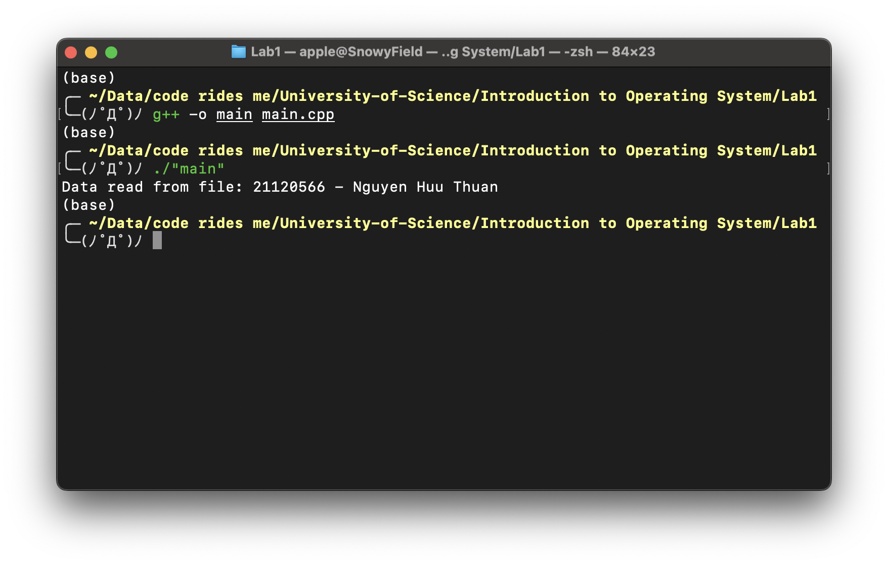

# Thread - Semaphore project

## Introduction

| Student ID | Full name        | Course             |
| ---------- | ---------------- | ------------------ |
| 21120566   | Nguyen Huu Thuan | Introduction to OS |

## Statement

- This project is about using **Semaphore** to control access to a file.
- There are 2 **Threads**: one for writing to file and one for reading from file.
- The **Semaphore** is used to make sure that only one **Thread** can access the file at a time.
- The file is opened in write mode, so the reading **Thread** will have to wait until the writing **Thread** finishes writing to the file.
- The file is opened in read mode, so the writing **Thread** will have to wait until the reading **Thread** finishes reading from the file.
- The **Semaphore** is initialized with value `1`, so the first **Thread** that accesses the file will be able to do so immediately.
- After finishing accessing the file, the **Thread** will post to the **Semaphore** to signal the other **Thread** that it can now access the file.

## Implementation

### Mutex

#### Attributes

- `mutex`: The **mutex** object implemented by the `pthread` library.

#### Methods

- `Mutex()`: The constructor of the class, initialize **mutex** with default attributes.
- `~Mutex()`: The destructor of the class, destroy **mutex** when going out of scope.
- `get()`: Return the pointer to **mutex**.
- `lock()`: Lock **mutex**, use `pthread_mutex_lock` implemented by the `pthread` library.
- `unlock()`: Unlock **mutex**, use `pthread_mutex_unlock` implemented by the `pthread` library.

### Condition

#### Attributes

- `condition`: The **condition** object implemented by the `pthread` library.

#### Methods

- `Condition()`: The constructor of the class, initialize **condition** with default attributes.
- `~Condition()`: The destructor of the class, destroy **condition** when going out of scope.
- `get()`: Return the pointer to **condition**.
- `wait(mutex)`: Wait for the **condition**, use `pthread_cond_wait` implemented by the `pthread` library.
- `post()`: Signal **condition**, use `pthread_cond_signal` implemented by the `pthread` library.

### Thread

#### Attributes

- `tid`: The **thread** id object implemented by the `pthread` library.

#### Methods

- `Thread(start_routine, arg)`: The constructor of the class, create a new thread with the given `start_routine` and `arg`.
- `join()`: Wait for the **thread** to finish, use `pthread_join` implemented by the `pthread` library.

### Semaphore

#### Attributes

- `count`: The **count** of the **semaphore**.
- `mutex`: The **mutex** object used to protect the **count**.
- `condition`: The **condition** object used to wait for the **semaphore** to be available.

#### Methods

- `Semaphore(initial_count)`: The constructor of the class, initialize **count** with the given `initial_count`.
- `*get_mutex()`: Return the pointer to **mutex**.
- `get_condition()`: Return the pointer to **condition**.
- `wait()`: Wait for the **semaphore** to be available, use `Mutex::lock` and `Condition::wait`.
- `post()`: Signal the **semaphore**, use `Mutex::unlock` and `Condition::signal`.

## Result

## Specifications

| No. | Specifications                                   | Total Percentage | Estimated |
| --- | ------------------------------------------------ | ---------------- | --------- |
| 1   | The program can be compiled.                     | 10%              | 10%       |
| 2   | Read and write threads run correctly.            | 30%              | 30%       |
| 3   | Synchronization between threads works correctly. | 30%              | 30%       |
| 4   | Return the desired result with no errors.        | 30%              | 30%       |
