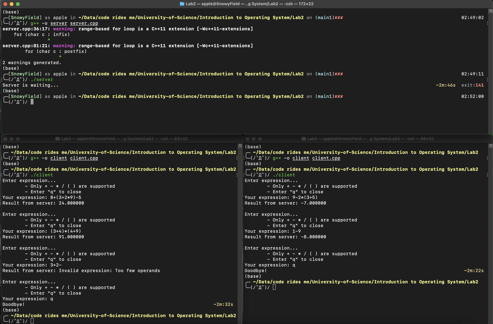

# Introduction

| Student ID | Full name        | Course                            |
| ---------- | ---------------- | --------------------------------- |
| 21120566   | Nguyen Huu Thuan | Introduction to Operating Systems |

# Statement

- This project is about using **Socket** to write a 1-to-n **Server-Client** program.
- The **Client** will send a string expressing a mathematical expression to the **Server**.
- The **Server** will calculate the result the expression and send it back to the **Client**.
- If the expression is invalid, the **Server** will send back an error message.
- The **Server** will be able to handle multiple **Clients** at the same time.

# Idea

## Server

- **Initialization**: Initialize the Server Socket, bind it to a specific port, and listen for incoming connections.
- **Multi-Client Handling**: Implement a multi-threaded approach to handle multiple Client connections concurrently.
- **Expression Evaluation**: Receive infix expressions from Clients, convert them to Polish Notation, evaluate, and send back the results.

## Client

- **Initialization**: Create a Client Socket and attempt to connect to the Server.
- **User Interaction**: Allow users to input mathematical expressions in infix notation.
- **Expressions Sending**: Send expressions to the Server for evaluation and display the received results.

# Implementation

## Server

- **Socket Setup:** Use `socket()`, `bind()`, and `listen()` functions to set up the Server Socket.
- **Multi-threading:** Implement a loop to accept connections and create a new Thread for each Client using `pthread_create()`.
- **Expression Handling:** Upon receiving expressions, convert them from infix to Polish Notation and evaluate the result.
- **Thread Management:** Ensure proper handling of Thread creation, detachment, and resource release using `pthread_detach()` and `pthread_join()`.

## Client

- **Socket Setup:** Use `socket()` and `connect()` functions to establish a connection to the Server.
- **User Input:** Allow users to input mathematical expressions in infix notation.
- **Sending Data:** Send the expressions to the Server using `write()` and wait for the response.
- **Display Results:** Receive and display the evaluated results from the Server.

# Result

# Specifications

| No. | Specifications                                 | Total Percentage | Estimated |
| --- | ---------------------------------------------- | ---------------- | --------- |
| 1   | The programs can be compiled.                  | 10%              | 10%       |
| 2   | Server and Client's Socket connect correctly.  | 30%              | 30%       |
| 3   | Thread creation and management work correctly. | 30%              | 30%       |
| 4   | Expression evaluation works correctly.         | 30%              | 20%       |
